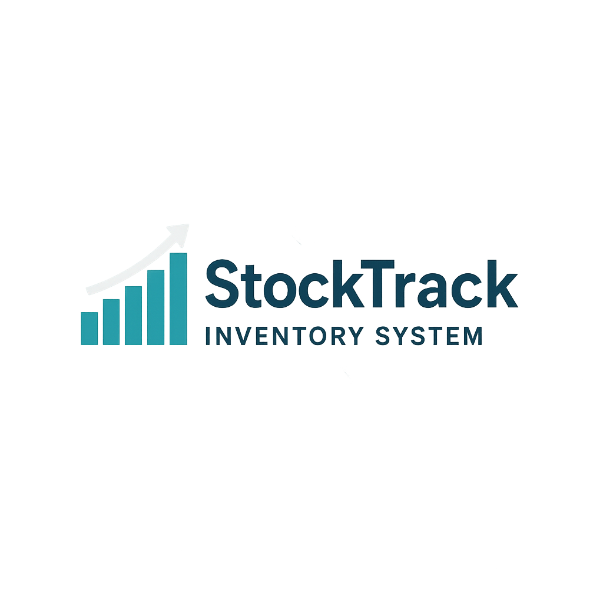

# Stock Track ( Your trusted Inventory Partner )

An advanced single-page application designed to streamline and simplify the inventory management process. This system provides robust features for tracking and managing inventory items, ensuring efficient and effective control over stock levels, orders, and shipments.
<div align="center">
    
</div>
## Created Using

This project is built using the following technologies:

- **Laravel**: A PHP framework for web artisans.
- **Inertia.js**: A modern approach to building single-page applications.
- **Vue.js**: A progressive JavaScript framework for building user interfaces.
- **Tailwind CSS**: A utility-first CSS framework for rapid UI development.

## Who's the Developer

Developed by Wilfredo Domanico Jr. I am passionate about creating efficient and user-friendly web applications. If you have any questions or would like to discuss potential collaborations, feel free to reach out.

## System Requirements

To run this project, you will need:

- PHP >= 8.4
- Composer
- Node.js >= v14.x
- npm or Yarn
- MySQL or any compatible database system

## How to Install

Follow these steps to get the project up and running on your local machine:

1. **Clone the Repository**:
    ```bash
    git clone https://github.com/wilfredo-domanico-jr/StockTrack.git
    cd inventory-management-system
    ```

2. **Install Dependencies**:
    - **Backend Dependencies**:
        ```bash
        composer install
        ```
    - **Frontend Dependencies**:
        ```bash
        npm install
        # or if you're using Yarn
        yarn install
        ```

3. **Set Up Environment Variables**:
    - Copy the `.env.example` file to `.env` and fill in your database and application details.
    ```bash
    cp .env.example .env
    ```

4. **Generate Application Key**:
    ```bash
    php artisan key:generate
    ```

5. **Import Database**:
    - Import the database included in the root directory named `stocktrackdb.sql`.

6. **Compile Assets**:
    ```bash
    npm run dev
    # or if you're using Yarn
    yarn dev
    ```

7. **Start the Application**:
    ```bash
    php artisan serve
    ```

    Open your browser and navigate to `http://localhost:8000`.

## My Socials

If you are interested in collaborating or have any questions, you can reach out to me through the following platforms:

- **GitHub**: [https://github.com/wilfredo-domanico-jr](https://github.com/wilfredo-domanico-jr)
- **LinkedIn**: [https://www.linkedin.com/in/wilfredo-domanico-jr-8a1841233/](https://www.linkedin.com/in/wilfredo-domanico-jr-8a1841233/)
- **Email**: wilfredo.domanico.jr@gmail.com

Feel free to connect with me and explore potential opportunities for collaboration!

---

Thank you for checking out my project! Your feedback and contributions are highly appreciated.

